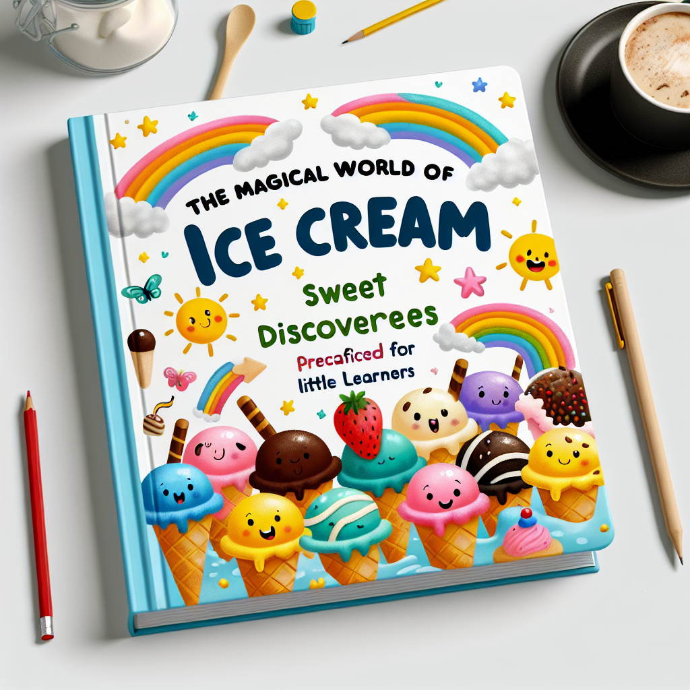

## Table of Contents

* [Chapter 1: Introduction to Ice Cream](#Chapter-1:-Introduction-to-Ice-Cream)
  * [Section 2.1: Exploring Different Ice Cream Flavors](#Chapter-1:-Introduction-to-Ice-Cream-Section-2.1:-Exploring-Different-Ice-Cream-Flavors)
  * [Section 2.2: Fun with Ice Cream Toppings](#Chapter-1:-Introduction-to-Ice-Cream-Section-2.2:-Fun-with-Ice-Cream-Toppings)
* [Chapter 2: Ice Cream Flavors and Toppings](#Chapter-2:-Ice-Cream-Flavors-and-Toppings)
  * [Section 2.1: Exploring Different Ice Cream Flavors](#Chapter-2:-Ice-Cream-Flavors-and-Toppings-Section-2.1:-Exploring-Different-Ice-Cream-Flavors)
  * [Section 2.2: Fun with Ice Cream Toppings](#Chapter-2:-Ice-Cream-Flavors-and-Toppings-Section-2.2:-Fun-with-Ice-Cream-Toppings)

# Chapter 1: Introduction to Ice Cream

## Section 1.1: What is Ice Cream?

Welcome to the sweet world of ice cream! Ice cream is a delightful frozen dessert made from cream, sugar, and flavorings. It comes in various delicious flavors and is enjoyed by people of all ages around the globe. Let's dive in to learn more about this scrumptious treat in our exploration of the world of ice cream!

From vanilla to chocolate, ice cream offers a spectrum of flavors to tantalize taste buds. Discover the history, ingredients, and how it's made in our flavorful journey through the world of ice cream.

## Section 1.2: The History of Ice Cream

Welcome to the delicious world of ice cream! In this section, we will explore the fascinating history of everyone's favorite frozen treat. From ancient times to modern-day innovations, get ready to learn how ice cream has evolved into the creamy delight we enjoy today.

Ice cream has a rich history dating back to ancient civilizations like the Chinese, Greeks, and Romans. Discover how flavors and methods have evolved over time!

### Questions

**Recall Question: What are the main ingredients used to make ice cream?**

**Comprehension Question: Why is ice cream enjoyed by people of all ages around the globe?**

**Application Question: If you were to create your own ice cream flavor, what ingredients would you choose and why?**

**Recall Question: What is the purpose of exploring the world of ice cream in this chapter?**

# Chapter 2: Ice Cream Flavors and Toppings

## Section 2.1: Exploring Different Ice Cream Flavors

Welcome to the delightful world of ice cream flavors! In this section, we will embark on a tasty journey to explore the wide variety of flavors that make ice cream so special. Get ready to discover the sweet, creamy, and sometimes surprising flavors that bring joy to every scoop.

From classic vanilla to exotic flavors like mango or matcha, ice cream offers a delicious array of taste sensations. Each flavor tells a unique story, inviting us to savor every spoonful.

## Section 2.2: Fun with Ice Cream Toppings

Welcome to the delectable world of ice cream toppings! In this section, we will explore the delightful array of toppings that can take a simple scoop of ice cream to a whole new level of sweetness and fun. Get ready to learn about the colorful, crunchy, and creamy toppings that make every ice cream experience a delicious adventure!

From chocolate sprinkles to fresh fruit slices, ice cream toppings add a burst of flavor and texture. Experiment with different combinations for a tasty treat!

### Questions

**Recall Question: What are some popular ice cream flavors?**

### ANSWER KEY

### Chapter 1: Introduction to Ice Cream

-*Answer: The main ingredients used to make ice cream are cream, sugar, and flavorings which create the delicious frozen dessert we all love.*
-*Answer: Ice cream is enjoyed by people of all ages around the globe because it comes in various delicious flavors that tantalize taste buds, making it a delightful treat for everyone.*
-*Answer: If creating their own ice cream flavor, students can choose ingredients like fruit, chocolate, or cookies to add different tastes and textures, allowing them to be creative and experiment with different flavors.*
-*Answer: The purpose of exploring the world of ice cream in this chapter is to learn about the history, ingredients, and how it's made, taking a flavorful journey through the delights of ice cream.*
### Chapter 2: Ice Cream Flavors and Toppings

-*Answer: Some popular ice cream flavors include vanilla, chocolate, strawberry, and mint.*
